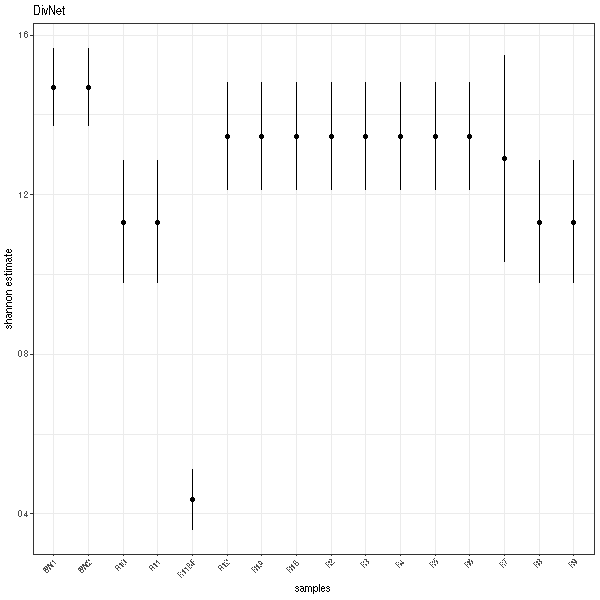

# Full Tutorial

You can find the scripts and data for this walk-through [on the GitHub page](https://github.com/mooreryan/divnet-rs/tree/master/test_files/lee_data_walkthrough).

DELETE? There, I show you how to analyze the Lee dataset included with the DivNet R package with `divnet-rs`, including getting data out of R into the format that `divnet-rs` wants, running `divnet-rs`, and then importing data back in to how and how to use it.

# Comparing DivNet and divnet-rs

I will use the Lee data grouped by phylum as in the [DivNet docs](https://github.com/adw96/DivNet/blob/31e04e29e4f3c02ea07c7f35873ee6743b79170a/vignettes/getting-started.Rmd).

## Run DivNet and generate divnet-rs input files

First you should check out [1_lee_phylum.R](https://github.com/mooreryan/divnet-rs/tree/master/test_files/lee_data_walkthrough/1_lee_phylum.R).  It is an R script for running DivNet on the Lee data aggregated by phylum.  It also generates the data that will be used fir `divnet-rs`.

## Run divnet-rs


Now you can run `divnet-rs` using the [2_lee_phylum_config.toml](https://github.com/mooreryan/divnet-rs/tree/master/test_files/lee_data_walkthrough/2_lee_phylum_config.toml) config file.  Something like this:

```
divnet-rs ./test_files/lee_data_walkthrough/2_lee_phylum_config.toml
```

You will notice that it is faster, but I just want to make it clear that on a dataset as small as this one I would use the the R version of DivNet.  Generally, you would only be using `divnet-rs` if whatever you want to do is impossible in the R version!

## Import divnet-rs output back into R

To see how to import the data back in to R so you can work with it, check out [3_import_divnet_rs_data.R](https://github.com/mooreryan/divnet-rs/tree/master/test_files/lee_data_walkthrough/3_import_divnet_rs_data.R).

## Wrap up

To try it out, assuming you haven't rearranged anything in the `divnet-rs` source directory, you can run the commands like this:

```
Rscript ./docs/lee_data/1_lee_phylum.R

OPENBLAS_NUM_THREADS=1 divnet-rs ./docs/lee_data/2_lee_phylum_config.toml

Rscript ./docs/lee_data/3_import_divnet_rs_data.R
```

Note the `OPENBLAS_NUM_THREADS=1` part in front of the `divnet-rs` command.  In my tests, forcing OpenBLAS to use a single thread results in much better `divnet-rs` performance.  See [this section of the divnet-rs manual](./config_files.md#number-of-threads) for more information about this.

### Plots

And here are the plots!  One thing that you will notice is that the error bars are a bit different.  This is because the MC-MH algorithm DivNet uses (and thus that `divnet-rs` uses) is dependent on random number generation.  So you'll get some noise run-to-run.

#### DivNet



#### divnet-rs


