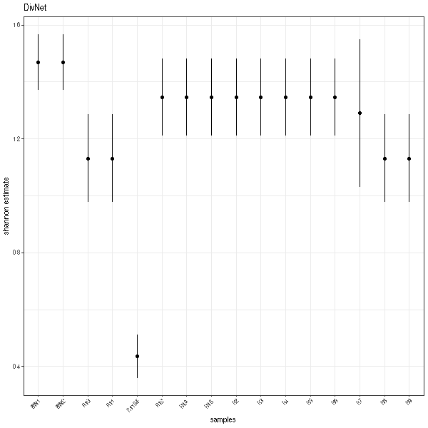

# Comparing DivNet and divnet-rs

I will use the Lee data grouped by phylum as in the [DivNet docs](https://github.com/adw96/DivNet/blob/31e04e29e4f3c02ea07c7f35873ee6743b79170a/vignettes/getting-started.Rmd).

## Run DivNet and generate divnet-rs input files

First you should check out `./1_lee_phylum.R`.  It is an R script for running DivNet on the Lee data aggregated by phylum.  It also generates the data that will be used fir `divnet-rs`.

## Run divnet-rs

Now you can run `divnet-rs` using the `2_lee_phylum_config.toml` config file.  Something like this:

```
divnet-rs ./docs/lee_data/2_lee_phylum_config.toml
```

You will notice that it is faster, but I just want to make it clear that on a dataset as small as this one I would *definitely* use the the R version of DivNet.  Generally, you would only be using `divnet-rs` if whatever you want to do is impossible in the R version!

If you noticed that there was no option for seeding the random number generator in `divnet-rs`, you're right, there isn't D: I hope to get around to this at some point!

## Import divnet-rs output back into R

To see how to import the data back in to R so you can work with it, check out `3_import_divnet_rs_data.R`.


## Wrap up

To try it out, assuming you haven't rearranged anything in the `divnet-rs` source directory, you can run the commands like this:

```
\time -f "system:%S, elapsed:%e, max cpu:%P, max mem:%Mkb" Rscript ./docs/lee_data/1_lee_phylum.R
# elapsed time:10.27s, max cpu:99%, max mem:563380kb

\time -f "elapsed time:%es, max cpu:%P, max mem:%Mkb" divnet-rs ./docs/lee_data/2_lee_phylum_config.toml
# elapsed time:1.12s, max cpu:381%, max mem:9500kb

\time -f "elapsed time:%es, max cpu:%P, max mem:%Mkb" Rscript ./docs/lee_data/3_import_divnet_rs_data.R
# elapsed time:4.63s, max cpu:99%, max mem:474952kb
```

Note that if you don't have a `time` command compatible with the custom output types, just leave it out.  Also, the `time` command is just a fun little comparison...NOT a very precise one as the `1_lee_phylum.R` script is doing more than just running `divnet`.

### Plots

And here are the plots!  One thing that you will notice is that the error bars are a bit different.  This is because the MC-MH algorithm DivNet uses (and thus that `divnet-rs` uses) is heavily dependent on random number generation.  So you'll get some noise run-to-run.  

#### DivNet



#### divnet-rs


